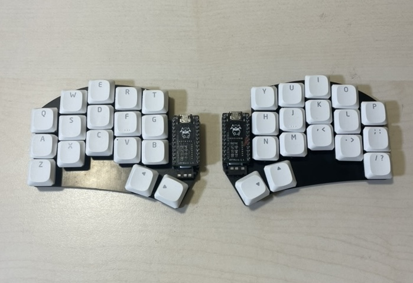

# Custom Split Keyboard



Wireless 34-key split keyboard with custom PCB and ZMK firmware.

## Features

- **Custom PCB**: half-swept design (KiCad project with gerbers, STEP/STL models)
- **Wireless**: nRF52-based microcontroller with Bluetooth multi-device support (3 profiles)
- **Home row mods**: Ctrl/Alt/Gui/Shift on home row for ergonomic access
- **5 layers**: QWERTY, Colemak, Numbers, Symbols, Function
- **Combos**: Vim macros (`:q!`, `:x`), media keys, navigation shortcuts
- **ZMK firmware**: Zephyr-based, highly customizable

## Layers

| Layer | Purpose |
|-------|---------|
| **BASE** | QWERTY layout with home row mods |
| **CMK** | Colemak alternative layout |
| **NUM** | Numbers, navigation (arrows, page up/down, home/end) |
| **SYM** | Symbols, brackets, operators |
| **FNC** | Function keys, Bluetooth profiles, system controls |

## Project Structure

```
config/          # ZMK keymap and configuration
half-swept/      # Custom PCB design (KiCad, gerbers, 3D models)
nrfmicro/        # nRF52 flashing configurations (OpenOCD, ST-Link)
```

## Build

Compile firmware using [ZMK documentation](https://zmk.dev/docs/user-setup). Flash with OpenOCD or ST-Link using configs in `nrfmicro/flashing/`.